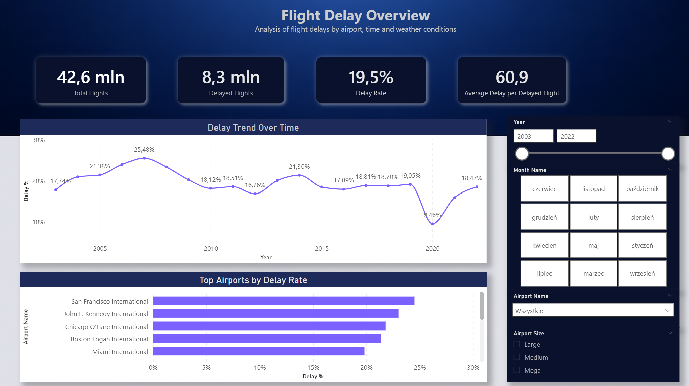
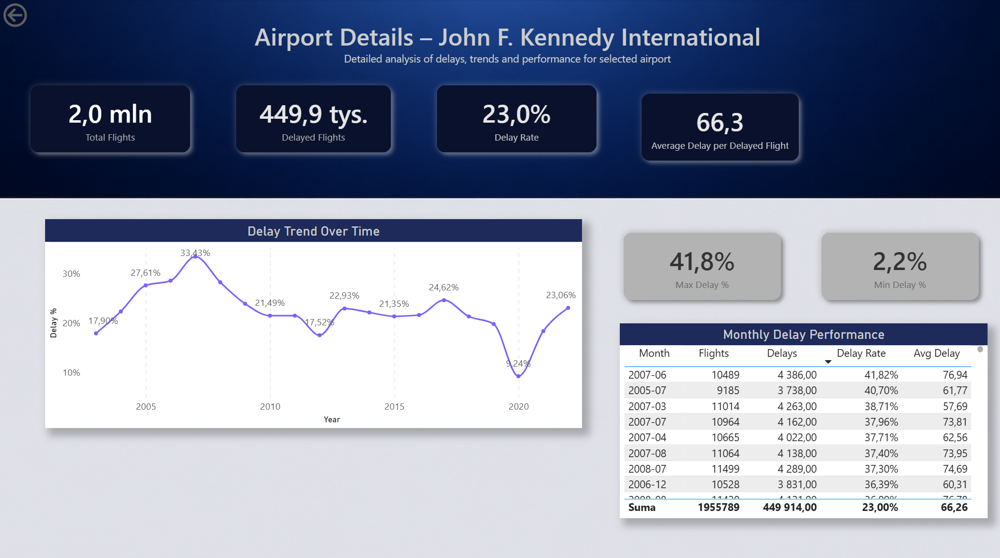
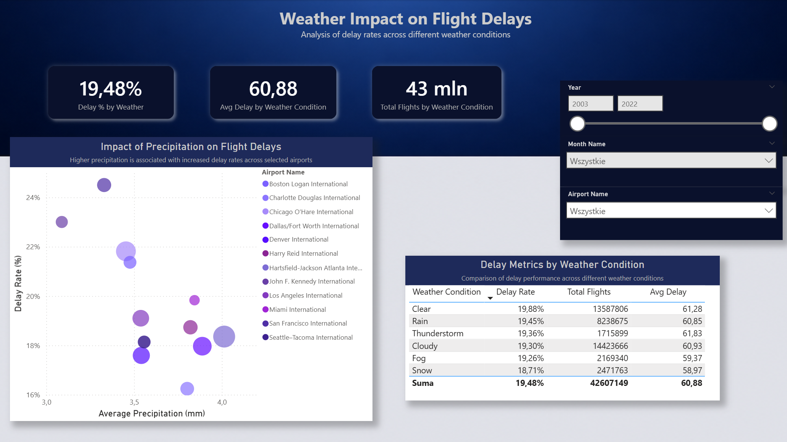

# Flight Delays Dashboard

## Project Overview
This project focuses on analyzing flight delays, airport performance, and operational trends using Power BI.

The dashboard was designed to support operational reporting and performance monitoring through interactive visualizations, KPI tracking, and drill-through analysis.

---

## Tools & Technologies
- Power BI
- DAX
- Data Modeling
- Data Visualization
- KPI Reporting
- Dashboard Design

---

## Project Objectives
- Analyze flight delay trends
- Monitor airport operational performance
- Identify patterns affecting delays
- Create interactive dashboards for reporting and decision-making

---

## Key Activities
- Built interactive Power BI dashboards and KPI visualizations
- Created calculated measures and drill-through reports using DAX
- Designed data models and relationships between datasets
- Developed operational performance reporting dashboards

---

## Dashboard Preview

### Overview Dashboard

### Airport Details Dashboard

### Weather Impact Dashboard

---

## Key Insights
- Certain airports experienced significantly higher delay percentages
- Seasonal and operational trends impacted overall delay performance
- Interactive drill-through analysis improved operational visibility

---

## Dashboard Export
[Download PDF Dashboard](flight_delays_dashboard.pdf)
